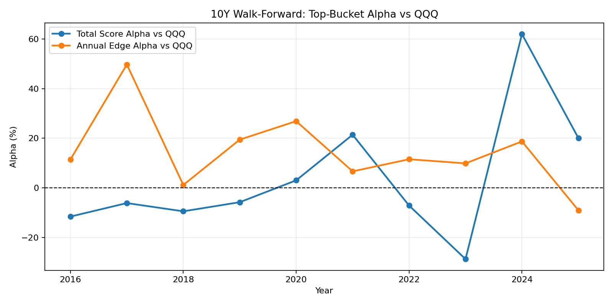
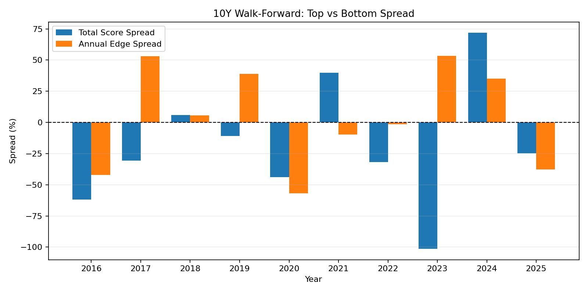
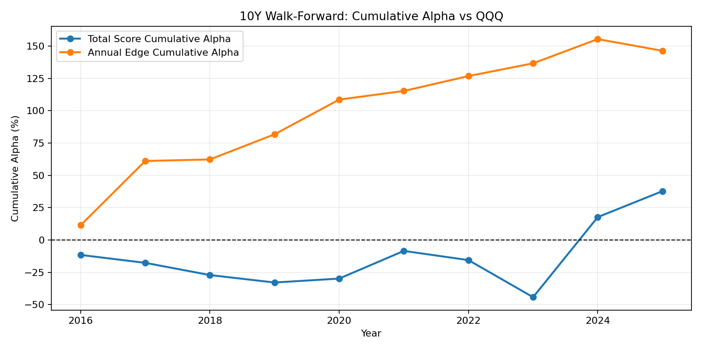

# Autostock

Autostock is a Telegram-based US stock scanning assistant.
It focuses on a simple pipeline:

1. Scan a stock universe (Nasdaq-100 + S&P 500)
2. Rank candidates with technical + quality scores
3. Generate a market report using Codex CLI login (no API key)

## Requirements

- Python 3.11+
- `codex` CLI installed and logged in (for AI report)
- Telegram bot token

## Install

```bash
pip install -r requirements.txt
```

## Environment Variables

Create `.env` with at least:

```env
TELEGRAM_BOT_TOKEN="your_telegram_bot_token"

# AI uses Codex CLI login, not manual API keys.
AI_PROVIDER="codex-cli"
AI_MODEL="gpt-5.2"
CODEX_BIN="codex"

# Optional default Telegram message style
# beginner | standard | detail
# (compact is kept as a legacy alias for beginner)
BOT_MESSAGE_STYLE="beginner"

# Optional trading integration (KIS)
KIS_APP_KEY=""
KIS_APP_SECRET=""
KIS_ACCOUNT_NO=""
KIS_ACCOUNT_PROD="01"
KIS_IS_PAPER="true"
```

## Codex Login

```bash
codex login
codex login status
```

`--ai` mode and scheduled AI reports require a valid Codex login session.

## Run

Run Telegram bot (with scheduler):

```bash
python src/main.py
```

Run Telegram bot (without scheduler):

```bash
python src/main.py --no-schedule
```

One-time scan:

```bash
python src/main.py --scan --limit 50
```

One-time AI market report:

```bash
python src/main.py --ai
```

One-time backtest summary:

```bash
python src/main.py --backtest --limit 40
```

## Telegram UX

- `/start`: opens main menu
- `/menu`: reopen main menu
- `/style [beginner|standard|detail]`: change message style (`compact` is alias of `beginner`)
- `/scan`: quick ranked scan
- `/analyze <SYMBOL>`: single-symbol analysis
- Send a symbol directly (for example `AAPL`) to analyze quickly
- Main menu `Settings` button for style toggle

## Data Sources

- Price/OHLCV: `yfinance`
- Universe lists: Wikipedia (Nasdaq-100, S&P 500) with local cache
- News: Google News RSS (no API key required)
- Analyst targets/recommendation trends: `yfinance` (no API key required)
- Market sentiment: Fear & Greed index API

## Project Structure

```text
src/
  ai/
    analyzer.py
  bot/
    bot.py
    handlers.py
    keyboards.py
    formatters.py
  core/
    indicators.py
    scoring.py
    signals.py
    stock_data.py
    news.py
    backtest.py
  trading/
    kis_api.py
    monitor.py
    portfolio.py
    watchlist.py
  config.py
  main.py
```

## Test

```bash
python -m pytest tests/ -q
```

## Validation Charts (10Y)

The following charts are generated from:

- `data/walkforward_10y_comparison_after_refactor.csv`

Generate (or refresh) the charts:

```bash
python scripts/generate_validation_charts.py
```

1. Top-bucket alpha vs QQQ (`total_score` vs `annual_edge`)



2. Top vs bottom spread by year



3. Cumulative alpha vs QQQ



## AI Chart Decision Backtest

Run chart-only AI decision validation:

```bash
set PYTHONPATH=src
python scripts/backtest_ai_chart_decisions.py
```

Universe options:

```bash
# Built-in universe (default: mega12)
set AI_UNIVERSE=nasdaq100

# Or provide an explicit list
# set AI_SYMBOLS=AAPL,MSFT,NVDA
```

Time-varying Nasdaq-100 constituents (reduces survivorship bias):

```bash
python scripts/build_nasdaq100_universe_by_date.py

set AI_UNIVERSE=nasdaq100
set AI_UNIVERSE_MODE=by_date
set AI_UNIVERSE_BY_DATE_FILE=data/universe/nasdaq100_by_date.json
```

Optional tuning variables:

```bash
# Horizon and rebalancing (for 1-year-or-less rotation style)
# Horizon is in trading days (21 ~= 1 month)
set AI_HORIZON_DAYS=63
# fixed_days | next_snapshot
set AI_HORIZON_MODE=next_snapshot
# quarterly | monthly | weekly
set AI_SNAPSHOT_FREQ=quarterly
# Limit the backtest window (useful when running monthly snapshots)
set AI_START_DATE=2016-01-01
set AI_END_DATE=2025-12-31
# Dev helper: run only the last N snapshots (0 = no limit)
set AI_MAX_SNAPSHOTS=0

# Rotation portfolio construction: buy only the top-K signals each snapshot (0 = no cap)
set AI_PORTFOLIO_TOP_K=5

# Optional: per-trade round-trip cost (basis points). Example: 20 bps = 0.20%
set AI_TRADE_COST_BPS=0

# AI prompt sizing (Nasdaq-100 / S&P 500 can be large)
# - When batching=false, only a subset is prompted each snapshot (faster/cheaper).
# - When batching=true, the universe is chunked and the LLM is called per chunk.
set AI_PROMPT_MAX_SYMBOLS=30
set AI_PROMPT_SELECT_MODE=mix
set AI_PROMPT_BATCHING=false

# Optional: tag outputs to avoid confusion when multiple runs happen
set AI_RUN_TAG=manual_run_001

# Walk-forward warmup rows (default: 24)
set AI_WF_WARMUP_ROWS=24

# Prior mapping before warmup:
# identity (default) | always_buy
set AI_WF_PRIOR_MODE=identity

# Mapping objective:
# execution_alpha (recommended) | composite | overall_hit | balanced_recall | sell_hold_precision
set AI_WF_OBJECTIVE=execution_alpha

# Minimum predicted support for SELL/HOLD when objective uses class constraints
set AI_WF_MIN_CLASS_SUPPORT=8

# Label mode:
# dynamic_alpha (default) | alpha | absolute
set AI_LABEL_MODE=dynamic_alpha

# Dynamic alpha label defaults (tuned for better SELL/HOLD usefulness)
set AI_ALPHA_BASE_PCT=0.8
set AI_HOLD_ATR_MULT=1.1
set AI_HOLD_MIN_PCT=2.0
set AI_HOLD_MAX_PCT=5.5
set AI_ALPHA_HOLD_MULT=1.5
set AI_RISKOFF_CUT_PCT=-3.0
set AI_RISKOFF_RELAX=0.85

# Execution (LONG/CASH) tuning (recommended starting point)
set AI_EXECUTION_MODE=long_cash
set AI_EXEC_EARNINGS_BLOCK_DAYS=1
set AI_EXEC_RISKOFF_HIGH_CONF=false
set AI_EXEC_MIN_RS63_BUY=-1.0
set AI_EXEC_RISKOFF_MIN_RS63=1.5
set AI_EXEC_MIN_ADX_BUY=10
set AI_EXEC_MIN_VOL_RATIO_BUY=0.7
set AI_EXEC_RISK_BUDGET_NEUTRAL=0.9
set AI_EXEC_RISK_BUDGET_OFF=0.55
set AI_EXEC_RISKOFF_BUY_SCALE=0.6
```

Outputs:

- `data/ai_chart_backtest_results.csv`
- `data/ai_chart_backtest_summary.json`

Each run also writes immutable artifacts:

- `data/runs/ai_chart_backtest_results_<run_tag>.csv`
- `data/runs/ai_chart_backtest_summary_<run_tag>.json`

### Auto-Tune Execution (No AI Calls)

Once `data/ai_chart_backtest_results.csv` exists, you can tune the execution thresholds/weights quickly
without re-calling the LLM:

```bash
python scripts/tune_ai_chart_execution.py
```

Useful tuning knobs:

```bash
set TUNE_TEST_START=2024-01-01
set TUNE_MAX_EVALS=400
set TUNE_OBJECTIVE=calmar_abs
set TUNE_MIN_EXPOSURE_PCT=25
set TUNE_TRADE_COST_BPS=0
```

Output:

- `data/ai_chart_tuning_best.json`

## Disclaimer

This project is for research and decision support.
All investment decisions and risk management remain your responsibility.
