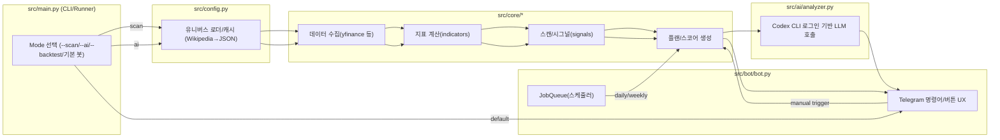
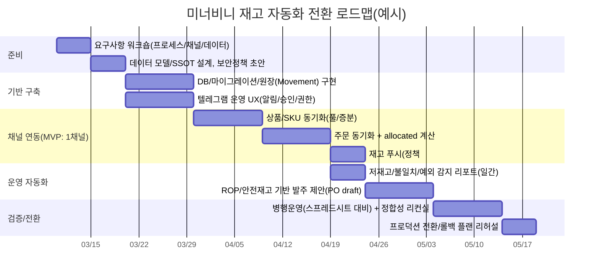

# 미너비니를 위한 needitem/autostock 적용·전환 심층 연구 보고서

## 핵심 요약

needitem/autostock는 **온라인 리테일 재고(Inventory) 자동화** 도구가 아니라, **미국 주식(US equity) 스캐닝·스코어링·백테스트**를 수행하고 결과를 **텔레그램 봇 UX로 전달**하는 리서치/의사결정 보조 프로젝트다. 따라서 미너비니(온라인 리테일/스몰 브랜드 가정)에 “그대로 적용”하기보다는, **(A) 자동화 프레임/배치·메시징 뼈대는 재사용**하고 **(B) 도메인(데이터 모델·연동·정책)을 재고 중심으로 전면 교체**하는 방식이 현실적이다. fileciteturn10file0L3-L13

핵심 재사용 가치가 높은 부분은 다음이다: (1) **단일 엔트리포인트(런너) + 모드 분기(일회성 실행/스케줄러 실행)** 구조, (2) **텔레그램봇 기반의 “비개발자 운영 UX”**(명령어, 메뉴, 스케줄 실행), (3) **파이프라인/리포트 생성 패턴**(정기 실행→요약 리포트→메시지 전송). fileciteturn11file0L1-L15 fileciteturn11file1L277-L334

미너비니의 재고 운영에 필요한 핵심 기능(재고 원장, 주문/출고/반품 흐름, 멀티채널 재고 동기화, 발주·리드타임·안전재고/재주문점 기반 보충, 권한·감사로그 등)은 autostock에 존재하지 않으므로, **추가 기능이 “증가”가 아니라 “신규 제품 개발” 수준**이 된다. 대신, Shopify/스마트스토어/카페24 같은 채널 API가 제공하는 **재고 수량 변경/조회 엔드포인트**를 중심으로 표준 커넥터를 만들고, 내부적으로는 **재고 이벤트(입고·출고·조정·반품) 원장 기반**으로 정합성을 확보하는 설계를 권장한다. citeturn8search0turn8search1 citeturn9search3turn9search2 citeturn9search4turn9search10

보안·컴플라이언스 측면에서, 재고 시스템은 주문/배송/고객정보 등 개인정보를 다루게 될 가능성이 높으므로, 국내 “개인정보의 안전성 확보조치 기준”의 요구(내부관리계획, 접근권한 차등, 접근통제, 암호화, 접속기록 등)를 전제로 설계해야 한다. citeturn21view0

개발팀 관점의 실행 결론은 다음 3가지 선택지로 정리된다.

- **선택지 1(권장, 현실적):** autostock를 “레퍼런스/뼈대”로 삼되, 재고 도메인용 신규 모듈·DB·커넥터를 구축(대규모 리팩터링).  
- **선택지 2(최소 변경):** 텔레그램 알림 봇만 먼저 구축(저재고·품절 임박 알림, 수동 조정) → 이후 단계적으로 DB/커넥터 확장.  
- **선택지 3(비권장):** autostock 코드 위에 재고 기능을 덧붙여 “주식+재고 혼재” 상태로 운영(장기 유지보수 비용 급증).

---

## autostock 현행 구조 분석

### 목적·스코프

README 기준으로 autostock의 스코프는 (1) 종목 스캐닝/스코어링, (2) 차트·레짐 기반 AI 코멘터리 생성, (3) QQQ 초과수익을 목표로 하는 AI 포트폴리오 백테스트, (4) 텔레그램 봇 기반 운영 UX이며, 뉴스 수집 모듈은 런타임/테스트에서 제거되었다고 명시되어 있다. fileciteturn10file0L6-L13

### 모듈 구성과 핵심 책임

프로젝트 구조는 크게 `src/ai`, `src/bot`, `src/core`, `src/trading`, `src/pipelines`, `scripts`, `tests`로 나뉘며, “주식(티커) 분석→리포트/권고 생성→텔레그램 전달” 중심의 모듈 분리가 되어 있다. fileciteturn10file0L209-L240

- **엔트리포인트 (`src/main.py`)**  
  단일 런너에서 `--scan`, `--ai`, `--macro`, `--deep`, `--deep-us`, `--all-us`, `--rebalance-us`, `--backtest` 등 모드를 분기하고, 아무 모드가 없으면 봇 실행으로 진입한다. fileciteturn11file0L1-L15 fileciteturn11file0L226-L272  
- **텔레그램 봇 (`src/bot/bot.py`)**  
  명령어(`/start`, `/menu`, `/style`, `/analyze`, `/us_report`, `/us_rebalance`)와 버튼 콜백을 처리하고, 스케줄러를 켠 상태에서 **일간 리포트 + 주간 리밸런싱 작업을 JobQueue로 예약**한다. fileciteturn11file1L115-L143 fileciteturn11file1L220-L274 fileciteturn11file1L277-L334  
- **유니버스/설정 (`src/config.py`)**  
  Nasdaq-100/S&P500 티커를 위키피디아 표에서 가져오고, 로컬 캐시(JSON)로 유지하며, yfinance로 섹터/산업 메타데이터를 병렬로 채운다. “import 시점 네트워크 콜 최소화”가 설계 목표로 명시되어 있다. fileciteturn28file0L3-L9 fileciteturn28file0L50-L90 fileciteturn28file0L169-L206  
- **핵심 스캐닝/시그널 (`src/core/signals.py`)**  
  `calculate_indicators`와 `get_stock_data/get_stock_info`, 시장 레짐 등을 결합해 스캐닝을 수행하고, 상대강도·유동성·이벤트 리스크 등을 조합해 “트레이드 플랜”을 구성한다(게이트/블로커 개념 포함). fileciteturn28file1L10-L13 fileciteturn28file1L64-L76 fileciteturn28file1L345-L463  
- **AI 분석 (`src/ai/analyzer.py`)**  
  Codex CLI 로그인 상태를 확인(`codex login status` 호출)하고, 세션 기반으로 LLM 응답을 생성하는 구조다. citeturn7view0  
- **의존성 (`requirements.txt`)**  
  `yfinance`, `pandas`, `python-telegram-bot[job-queue]`, `requests`, `ta`(기술적 지표), HTML 파싱 라이브러리, `pykrx`, `pytest` 등을 사용한다. fileciteturn27file0L1-L16  
  특히 `python-telegram-bot`의 JobQueue는 APScheduler 래퍼이며, `job-queue` extra 설치가 필요하다는 점이 공식 문서에 명시돼 있다. citeturn0search1turn22search5  

### 데이터 흐름과 실행 흐름

autostock의 핵심 데이터 흐름은 “티커 목록(유니버스) → 시세/기초데이터 수집 → 지표/스코어/플랜 생성 → 리포트 렌더링 → 텔레그램 전송(또는 콘솔 출력)”이다. 유니버스는 위키피디아에서 수집·캐시되며, OHLCV는 yfinance를 사용한다고 README에 명시되어 있다. fileciteturn10file0L203-L208 fileciteturn28file0L73-L87

또한 텔레그램 메시지 길이 제한(“entities parsing 후 1~4096 글자”)은 Bot API에 명시돼 있고, autostock는 긴 메시지를 newline 기준으로 쪼개어 전송한다. citeturn22search0 fileciteturn11file1L56-L75



### 배포·통합 지점

- **환경변수(.env)**: 텔레그램 토큰, Codex CLI 사용 모델/경로, 스케줄 시간(Asia/Seoul), KIS 연동 키 등이 README에 정리되어 있다. fileciteturn10file0L30-L64  
- **실행 방식**: `python src/main.py`로 봇(+스케줄러) 실행, 혹은 `--no-schedule`로 스케줄러 비활성, 일회성 실행 모드는 `--scan`, `--ai`, `--backtest` 등으로 제공된다. fileciteturn10file0L75-L110 fileciteturn11file0L226-L272  
- **테스트**: pytest 기반 테스트 실행을 안내하며, “122 passing tests”를 명시한다. fileciteturn10file0L193-L201  

### 미너비니 관점의 적합성 진단

autostock는 **“inventory stock(재고)”가 아니라 “stock(주식)”**에 최적화돼 있다. 즉,
- 데이터 모델이 “티커/시장지표/리밸런싱” 중심이고 fileciteturn10file0L6-L13  
- 채널 연동이 “금융 데이터/증권 API” 중심이며 fileciteturn10file0L58-L64  
- 재고 운영의 핵심인 “입출고 원장, 주문 할당(Allocated), 반품/교환, 발주/공급사 리드타임”이 존재하지 않는다.

따라서 **재사용 가능한 것은 실행·스케줄·메시징 패턴**이고, **교체해야 하는 것은 도메인 전체**라는 결론이 나온다.

---

## 미너비니 재고 워크플로와 autostock 역량 매핑

### 미너비니(온라인 리테일/스몰 브랜드 가정) 표준 재고 업무 흐름

미너비니가 멀티채널(예: 자사몰/마켓)을 운영한다면, 최소한 아래 흐름을 갖는다.

1) 상품/옵션(SKU) 마스터 정리 → 2) 채널별 재고 동기화 → 3) 주문 유입 → 4) 출고/송장/배송 → 5) 반품/교환/재입고 → 6) 재고보충(발주) 및 리드타임 관리 → 7) 분석(품절률·재고회전·매입/보관비).  
(채널 API 관점에서 “재고 변경”은 공통적으로 핵심 엔드포인트로 제공된다: Shopify는 InventoryLevel 조정/설정 API를 제공한다. citeturn8search0turn8search1 / 네이버 커머스API는 상품 옵션 재고 변경/멀티 상품 변경을 문서화한다. citeturn9search3turn9search2 / 카페24는 Admin API/Front API 구분과 OAuth2 인증을 안내하고, 마켓 연동 시 자사몰에서 상품명·옵션·가격·재고 변경이 자동 반영된다고 안내한다. citeturn9search4turn9search10)

### autostock→재고 자동화로의 “개념 변환” 매핑

| autostock 구성요소/개념 | 현재 의미(주식) | 미너비니용 재해석(재고) | 적용 난이도 |
|---|---|---|---|
| Universe(티커 목록) | 분석 대상 종목 집합(나스닥100/ S&P500) fileciteturn28file0L73-L87 | **SKU/옵션(Variant) 목록 + 채널별 매핑 테이블** | 중 |
| Data fetch & cache | 시세/OHLCV 수집, 캐시 fileciteturn10file0L203-L208 | **주문/재고/상품 API 폴링 + 증분 동기화 + 캐시/레이트리밋** | 중~상 |
| Indicators/Score | 기술적 지표/스코어링 | **재고 KPI(판매속도, Days of Supply, 품절위험점수)** | 상(신규) |
| Trade plan / gates | 매수·분할매수·손절·목표가 + 조건 게이트 fileciteturn28file1L345-L463 | **발주 제안(수량/납기/공급사) + 실행 게이트(MOQ, 예산, 리드타임, 창고용량)** | 상(신규) |
| Backtest | 전략 수익률 검증 fileciteturn11file0L136-L160 | **재고정책 시뮬레이션(품절률/보관비/서비스레벨)** | 상(재설계) |
| Telegram UX + Scheduler | 비개발자 운영 인터페이스, 정기 실행 fileciteturn11file1L277-L334 | **운영자 알림·승인·예외처리(저재고/발주승인/재고조정)** | 하~중(재사용 가능) |
| AI commentary | 시장/종목 코멘터리 | **재고·매입·프로모션 계획 코파일럿(요약/리스크/권고)** | 중(선택) |

---

## 미너비니 적용 시나리오와 사용자 스토리

image_group{"layout":"carousel","aspect_ratio":"16:9","query":["small ecommerce inventory dashboard","warehouse barcode scanning inventory management","telegram bot business notification interface"],"num_per_query":1}

### 운영 시나리오

**시나리오 A: 멀티채널 판매 중 ‘재고 틀어짐’ 방지(최우선)**  
- 매일 새벽 1회, 채널(예: 자사몰/스마트스토어)에서 SKU별 “가용 재고”를 읽어 내부 DB에 스냅샷 저장  
- 내부 원장(전일 주문/출고/반품/조정)을 반영하여 “내부 정답 재고”를 계산  
- 채널별 정책에 따라 “재고를 어디로 푸시할지(단방향/양방향)” 결정  
- 차이가 임계치 이상이면 텔레그램으로 “불일치 SKU 목록 + 원인 후보 + 원클릭 조정” 전송

(스마트스토어는 커머스API로 상품 옵션 재고 변경 기능을 제공한다. citeturn9search3 / Shopify도 InventoryLevel 조정·설정 API를 제공한다. citeturn8search0turn8search1)

**시나리오 B: 품절 임박 알림 + 발주 제안(재고 보충 자동화)**  
- SKU별 평균 일판매량과 리드타임을 기반으로 재주문점을 계산  
- 변동성이 있으면 “안전재고 포함 ROP”를 사용(ROP = 리드타임 수요 + 안전재고) citeturn10search1turn10search3  
- 임계치 하회 시, 텔레그램으로 “발주 권고 수량/예상 도착일/예산 영향”을 전송하고 승인/보류를 기록

**시나리오 C: 반품/교환 처리로 인한 재고 오염 최소화**  
- 반품 접수 시 “검수 대기(Quarantine)” 상태로 이동  
- 검수 완료 후 “재판매 가능/불량 폐기/수선”으로 분기  
- 상태 전환이 내부 원장에 남고, 채널 재고는 “재판매 가능만” 반영

### 사용자 스토리(예시)

- (대표/운영) “오늘 품절 위험이 가장 큰 10개 옵션을 보고, 발주 승인만 누르고 싶다.”  
- (CS) “고객에게 ‘언제 재입고되나요?’ 질문이 왔을 때, 실제 ETA와 예약재고(allocations)를 근거로 답하고 싶다.”  
- (물류) “출고 마감 전에 ‘피킹해야 할 주문 수량’과 ‘현재 가용 재고’를 한 화면/한 메시지로 확인하고 싶다.”  
- (회계/정산) “월말에 SKU별 매입단가·재고자산·재고조정 이력을 CSV로 뽑고 싶다.”  

---

## 기능 제안: 추가·개선·삭제

### 현재 vs 제안 기능 세트 비교(요약)

| 영역 | autostock 현재 | 미너비니 제안(목표 상태) |
|---|---|---|
| 도메인 모델 | 티커/시장/전략/리포트 fileciteturn10file0L6-L13 | 상품(SKU/옵션)/창고/재고원장/주문/출고/반품/발주 |
| 데이터 소스 | yfinance·위키피디아·Fear&Greed 등 fileciteturn10file0L203-L208 | 채널 API(Shopify/스마트스토어/카페24) + 택배/ERP(선택) |
| 실행 UX | 텔레그램 봇 + 스케줄러 fileciteturn11file1L277-L334 | 텔레그램 “알림+승인” 우선, 이후 웹 대시보드(선택) |
| 자동화 목표 | 종목 발굴/리밸런싱 | **재고 정합·품절 방지·발주 최적화** |
| 저장소 | 로컬 캐시/리포트 파일 위주 fileciteturn28file0L30-L37 | **중앙 DB(PostgreSQL 권장) + 이벤트 원장** |
| AI | Codex CLI 기반 코멘터리 fileciteturn10file0L3-L4 | 재고 요약/발주 메모 생성(옵션), 개인정보 최소화 필수 |

### 추가/개선 기능 상세 제안

아래는 “autostock를 기반으로 1개 서비스(재고 자동화)로 전환”한다는 가정의 제안이다. 우선순위는 P0~P2, 노력(대략)은 1~5(낮음~높음), 리스크는 기술/운영/컴플라이언스 관점에서 요약한다.

#### P0: 재고 원장(Inventory Ledger) + 정합성 엔진

**목표**: “현재 재고(available)”가 어디서든 하나의 원천(SSOT)에서 계산되고, 모든 변경이 이벤트로 추적되게 한다.  
**왜 필요한가**: 멀티채널에서 재고를 직접 수정하면 틀어질 확률이 높고, 원장 없이는 원인 분석이 불가능하다(반품/조정/분실/입고누락).  
**핵심 설계**: 재고는 수량 필드 하나가 아니라, **이벤트들의 합**으로 계산한다.

- **데이터 모델(초안)**

```text
Product(id, name, brand, status)
Variant(id, product_id, sku, option_name, barcode, unit_cost, reorder_pack_qty, is_active)

Location(id, name, type)                     # 창고/매장/외주3PL
InventoryBalance(variant_id, location_id, on_hand, allocated, available, updated_at)

InventoryMovement(id, ts, variant_id, location_id,
  type,                      # INBOUND, SHIP, RETURN, ADJUST, DAMAGE, TRANSFER
  qty_delta,                 # +입고/-출고
  ref_type, ref_id,          # Order, Return, PurchaseOrder 등
  reason, actor, meta_json
)
```

- **API(내부 운영용, 예시)**

```http
POST /inventory/movements
GET  /inventory/balances?location_id=&sku=&updated_since=
POST /inventory/reconcile/run
```

- **UX(텔레그램)**:  
  - `/low_stock` (품절 임박 목록) → “조정/보류/발주제안 보기” 버튼  
  - `/adjust SKU -2 reason=분실` 같은 간단 입력도 지원(권한 필요)

**연동 포인트**: 채널에서 내려오는 주문(출고 예정)을 `allocated`로 잡고, 실제 출고 확정 시 `SHIP` 이벤트로 `on_hand` 감소.

#### P0: 채널 커넥터(Shopify/스마트스토어/카페24 중 택1로 시작)

**원칙**: “먼저 1개 채널에서 end-to-end를 완성”하고, 이후 커넥터 추상화를 통해 확장한다.

- **Shopify(예시)**: InventoryLevel 조정/설정/조회 API 제공. citeturn8search0turn8search1  
- **스마트스토어(네이버 커머스API)**: “상품 옵션 재고 변경”, “멀티 상품 변경” 등 재고/판매가/상태 변경 기능을 문서로 제공. citeturn9search3turn9search2  
- **카페24**: Admin API는 OAuth2 인증을 통과한 경우에만 호출 가능하며, 관리자용 CRUD에 적합하다는 가이드가 있다. citeturn9search4  
  또한 마켓 연동 후 자사몰에서 상품명/옵션/가격/재고 변경 시 마켓에 자동 반영된다는 운영 가이드가 있다. citeturn9search10

**커넥터 공통 인터페이스(권장)**

```python
class ChannelConnector:
    def pull_catalog(self) -> list[VariantMap]
    def pull_inventory(self) -> list[ChannelStock]
    def pull_orders(self, since: datetime) -> list[Order]
    def push_inventory(self, changes: list[StockUpdate]) -> PushResult
```

**리스크**: 채널별 레이트리밋/부분실패/재시도·중복호출에 대비해 **idempotency key**와 **증분 동기화 커서**가 필수.

#### P1: 재주문점(ROP)·안전재고 기반 “발주 제안” 엔진

**핵심 공식(운영형)**  
- 결정론(변동성 무시): `ROP = (평균 일수요 × 리드타임)` citeturn10search0turn10search1  
- 변동성 포함(서비스 레벨 목표): `ROP = (평균 일수요 × LT) + (Z × σd × √LT)` citeturn10search1turn10search3  

**입력 데이터(최소)**  
- SKU별 일별 판매량 시계열(채널 주문에서 산출)  
- 공급사 리드타임(LT)과 최소주문수량(MOQ)/포장단위  
- 서비스레벨 목표(예: 90/95/97%) → Z 값 매핑

**출력(텔레그램/CSV/화면)**  
- “발주 후보 TOP N”: 현재 available, ROP, 권고 발주량(EOQ는 선택)  
- 대표/운영 승인 버튼: `승인 → PO 생성`, `보류`, `수동수정`

#### P1: 운영 리포트(일간/주간)와 예외 감지

autostock의 강점인 “정기 리포트 생성→텔레그램 전송” 패턴을 그대로 재사용한다. 봇은 이미 JobQueue로 일간/주간 작업을 예약한다. fileciteturn11file1L298-L321  
또한 JobQueue는 APScheduler 기반이며 주기 작업에 적합하다. citeturn0search1turn22search5

**추천 리포트**  
- 일간: 저재고/품절, 재고 불일치, 출고 지연, 반품 적체  
- 주간: SKU별 재고회전(추정), 베스트/저판매, 재고자산 추정, 리드타임 KPI

#### P2: 웹 대시보드(선택)

스몰 팀이면 “텔레그램만으로도 1차 효용”은 나오지만, SKU가 많아지면 검색/필터/다운로드가 필요하다. 따라서 P2로 웹 대시보드를 권장한다(예: 관리자 로그인, SKU 검색, 원장 조회, PO 관리).

### 제거/단순화 권고 기능

**제거(또는 별도 아카이브) 권고**: 미너비니 재고 자동화와 직접 연관이 없고 유지비만 증가시키는 구성이다.

- 기술적 지표/주식 스코어링/리밸런싱 및 관련 파이프라인(주식 의사결정용) fileciteturn10file0L6-L13  
- yfinance/pykrx 기반 주가 데이터 처리(재고용으로는 불필요) fileciteturn27file0L1-L11  
- KIS(한국투자증권) 연동 키/주문 기능(리테일 재고와 무관) fileciteturn10file0L58-L64  
- “딥 리서치/매크로/AI 포트폴리오 백테스트” 스크립트(초기 재고 MVP 범위에서 제외) fileciteturn10file0L112-L177  

**단순화 권고**  
- AI 기능: 초기에는 “요약 생성”을 제한적으로 사용하고, **개인정보(고객명/주소/전화) 제거 후** 요약만 전달하는 형태로 제한(컴플라이언스·보안 리스크 완화). Codex CLI 세션 의존 구조도 운영 안정성 관점에서 점검 필요. fileciteturn10file0L3-L4 citeturn7view0

---

## 통합·마이그레이션 및 로드맵

### 권장 통합 전략

**1단계(채널 단일화)**: “미너비니의 실제 주력 판매 채널 1곳”을 정해 end-to-end를 완성  
- 이유: 스마트스토어/Shopify/카페24는 인증·리소스 모델·레이트리밋이 달라 한 번에 다 하면 실패 확률이 높다. citeturn9search2turn9search4  

**2단계(SSOT 확립)**: 내부 DB + 원장 기반으로 “정답 재고”를 계산하고, 채널은 “표현 레이어”로 다룬다. (일부 채널에는 단방향 푸시만)

**3단계(정책 자동화)**: ROP/안전재고/리드타임을 도입해 발주 제안을 자동화하고, 승인 워크플로를 텔레그램으로 제공

### 일정(예시, 10주) — Gantt



### 필요 인력·역할(최소)

- 백엔드 1~2명(커넥터 + 원장/정책 엔진)  
- 운영/도메인 오너 1명(상품/SKU 규칙, 리드타임, 발주 의사결정)  
- QA/운영 테스트 0.5명(시나리오 테스트/데이터 정합 검증)  
- DevOps 0.5명(배포/시크릿/모니터링)

### 테스트 전략

autostock는 pytest 기반 테스트 문화를 갖고 있으므로, 이를 유지·확장하는 것이 합리적이다. fileciteturn10file0L193-L199

- **단위 테스트**: 원장 합산(available 계산), ROP/안전재고 계산, 권한 체크  
- **통합 테스트**: 채널 API sandbox/모의 응답 기반 “주문→출고→재고 푸시” 흐름  
- **회귀 테스트**: 스프레드시트 기준값과 결과 비교(병행운영 기간)

### 롤백 플랜(필수)

재고 푸시는 판매 중단(품절/과판매)로 직결되므로 롤백은 “기술”이 아니라 “운영 필수 기능”이어야 한다.

- **킬 스위치**: `PUSH_INVENTORY_ENABLED=false` 같은 글로벌 플래그(.env/시크릿)  
- **Idempotent 설계**: 동일 커서/동일 이벤트에 대해 중복 푸시가 발생해도 결과가 동일해야 함  
- **스냅샷 백업**: 푸시 전 “채널 재고 스냅샷” 저장 → 롤백 시 역방향 조정 가능  
- **권한 분리**: 푸시 기능은 관리자만 실행(텔레그램 승인/웹 승인)

---

## 보안·컴플라이언스·성능·비용 및 호스팅

### 보안·컴플라이언스(대한민국 기준)

재고 자동화는 주문/배송 데이터를 통해 개인정보를 처리할 가능성이 매우 높다. 따라서 “개인정보의 안전성 확보조치 기준(개인정보보호위원회고시)”의 기술적·관리적·물리적 조치 요구를 설계 전제조건으로 두어야 한다. 이 기준은 내부관리계획 수립, 접근권한 관리, 접근통제, 암호화, 접속기록 보관 등의 항목을 포함한다. citeturn21view0

특히 아래 항목들은 미너비니 시스템 설계와 직접 연결된다.

- **내부 관리계획**: 개인정보 보호 조직/역할, 접근권한, 접근통제, 암호화, 접속기록, 사고 대응, 위탁 관리 등을 포함해야 함. citeturn21view0  
- **접근권한 차등·계정 공유 방지**: 업무상 필요한 최소 범위로 권한을 차등 부여하고, 계정 공유를 방지하는 내용이 포함된다. citeturn21view0  
- **외부 접속 시 안전한 인증수단**: 외부에서 개인정보처리시스템 접속 시 OTP 등 안전한 인증수단 요구가 명시된다. citeturn21view0  
- **암호화**: 인증정보(비밀번호 등) 저장/송수신 시 암호화(비밀번호는 일방향), 고유식별정보/결제정보 등은 암호화 저장 요구가 명시된다. citeturn21view0  

또한 웹/API 기반 관리자 기능을 추가할 경우, OWASP Top 10이 제시하는 “Broken Access Control(접근제어 실패)” 위험이 가장 흔하고 영향이 크다는 점을 보안 표준으로 삼아야 한다. citeturn25search3turn25search0  
즉, “SKU/주문/고객 레코드”에 대해 **서버 사이드에서 데이터 레벨 권한을 강제**하고, 기본 deny, 감사로그, 레이트리밋을 기본값으로 두는 것을 권장한다. citeturn25search0

### 텔레그램 UX 보안 포인트

텔레그램 봇 메시지는 4096자 제한(엔티티 파싱 후)을 갖고 있으며, autostock가 이를 고려해 분할 전송하는 방식은 재고 리포트에도 그대로 적용 가능하다. citeturn22search0 fileciteturn11file1L56-L75  
또한 공식 튜토리얼은 “봇 토큰을 비밀번호처럼 취급”할 것을 강조하므로, 토큰은 코드/로그에 남기지 말고 시크릿으로 관리해야 한다. citeturn26search0

### 성능·안정성 고려

- **채널 API 레이트리밋**: 폴링 주기/배치 크기/증분 커서 기반으로 설계  
- **정합성 우선**: “빠른 갱신”보다 “재고 오염 방지”가 우선(실시간이 꼭 필요하면 이벤트 기반으로 단계적 확장)  
- **작업 큐/스케줄러**: autostock처럼 JobQueue 기반으로 시작하되, 향후 주문량 증가 시 분리(워커, 큐) 고려. JobQueue가 APScheduler 기반임은 공식 문서에 명시되어 있다. citeturn22search5

### 호스팅/비용 추천(2026 관점, 예시)

미너비니의 팀/예산/트래픽이 불명확하므로 “저비용·단순 운영”과 “확장성” 두 트랙을 제안한다.

**트랙 1: 단순 운영(저비용) — 단일 VM + 매니지드 DB**  
- 앱 서버: **Amazon Lightsail** (최저 $5/월 번들 등 가격표 제공). citeturn23search1  
- DB: 초기에는 VM 내 PostgreSQL도 가능하지만, 안정성을 중시하면 **Amazon RDS for PostgreSQL** 검토(온디맨드/RI, 프리티어 조건 등 안내). citeturn23search0  
- 장점: 운영 단순, 예측 가능한 비용  
- 단점: 트래픽 급증/작업 확장 시 수평 확장 난이도

**트랙 2: 서버리스(확장/비용 탄력) — Cloud Run + 매니지드 DB**  
- 앱: **Google Cloud Run** (2M 요청 무료, CPU/메모리 과금 및 무료티어 수치/단가 공개). citeturn24search1turn24search3turn24search5  
- 장점: scale-to-zero, 배치/웹 동시 운영에 유리  
- 단점: 네트워크/DB 연결 설계가 익숙하지 않으면 진입장벽

**트랙 3: PaaS(개발팀 소규모에 유리) — Render**  
- DB(예: legacy 기준 참고): Starter $7/월 등 플랜·스펙을 문서화. citeturn24search6  
- 장점: 배포/SSL/모니터링이 단순  
- 단점: 특정 제약/벤더 종속

---

## 개발팀을 위한 실행 가능한 다음 단계

### 즉시 착수 체크리스트(1주 내)

1) **미너비니 현행 운영 파악(문서화)**  
- 판매 채널(Shopify/스마트스토어/카페24 등), SKU 수(옵션 포함), 일 주문량, 출고 마감, 반품 비율  
- “재고의 정의” 합의: on_hand / allocated / available  
- 재고 조정 사유 코드 표준화(분실/불량/샘플/촬영 등)

2) **채널 1개 선정**  
- “재고를 누가 진실로 보느냐(SSOT)” 결정: 내부 DB 우선(권장) vs 채널 우선  
- 채널 API 권한/인증 준비(스마트스토어 커머스API는 가입/앱 등록/게이트웨이 호출/인증을 안내). citeturn9search2

3) **MVP 스코프 고정(P0만)**  
- Inventory Ledger + 주문 동기화 + 저재고 알림 + 수동 조정(텔레그램)  
- “발주 제안(ROP)”은 P1로 두되, 데이터 수집부터 시작

### 코드베이스 작업 지침(autostock 기반 전환 시)

- `src/main.py`의 “모드 분기” 패턴은 유지하고, `--scan`을 `--sync`(동기화), `--ai`를 `--report`(재고 요약)로 치환해 의미를 바꾼다. fileciteturn11file0L226-L272  
- `src/bot/bot.py`의 JobQueue·명령어 UX는 유지하되, `/us_report`, `/us_rebalance`는 `/inventory_report`, `/replenishment_plan` 등으로 교체한다. fileciteturn11file1L288-L294  
- `src/core/*`는 폴더 자체를 `inventory/` 도메인으로 재구성하고, 기존 주식 지표 코드는 과감히 제거(또는 별도 브랜치/태그로 보관)한다. fileciteturn10file0L209-L240  
- `.env`는 토큰/시크릿 중심으로 재정의하되, 텔레그램 토큰은 “비밀번호처럼” 취급하여 시크릿 스토어로 옮긴다. citeturn26search0

### 리포지토리 핵심 파일 링크(참조용)

```text
https://github.com/needitem/autostock/blob/master/README.md
https://github.com/needitem/autostock/blob/master/src/main.py
https://github.com/needitem/autostock/blob/master/src/bot/bot.py
https://github.com/needitem/autostock/blob/master/src/config.py
https://github.com/needitem/autostock/blob/master/src/core/signals.py
https://github.com/needitem/autostock/blob/master/requirements.txt
```

### 우선순위 로드맵(권장)

| 우선순위 | 기간(예시) | 산출물 | 성공 기준 |
|---|---:|---|---|
| P0 | 4~6주 | 원장+DB, 채널1개 동기화(상품/주문/재고), 저재고 알림(텔레그램), 수동 조정 | “재고 불일치 원인 추적 가능”, 품절 사고 감소 |
| P1 | 2~4주 | ROP/안전재고 기반 발주 제안, PO draft/승인 흐름 | 발주 의사결정 시간이 단축, 품절률 KPI 개선 |
| P2 | 2~4주 | 웹 대시보드, 멀티채널 확장, 고급 리포트 | 운영자/CS/물류가 동일한 SSOT로 협업 |

위 로드맵은 “재고 정합→품절 방지→발주 최적화”의 순서로 가치가 누적되며, 이는 채널 API들이 제공하는 “재고 변경 엔드포인트”를 안전하게 사용하기 위한 전제(SSOT/원장/권한/로그)와도 정합적이다. citeturn8search0turn9search3turn21view0